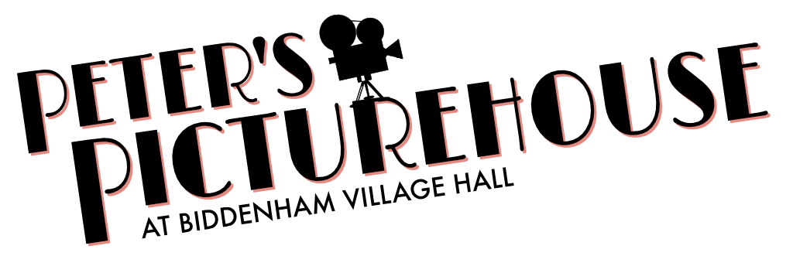

# Management of Peter's Picturehouse data for Biddenham Village



## Installation

- Create a virtual environment and activate it:

  ```shell
  uv venv .venv
  source .venv/bin/activate  # (MacOS)
  .venv\Scripts\Activate  # (Windows)
  ```

- Install the required packages:

  ```shell
  uv pip install -r requirements.txt
  ```

## Running

`python build.py`
